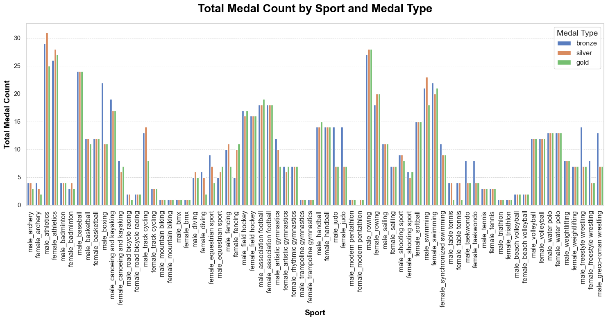
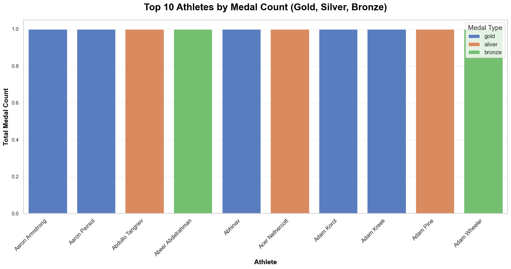

# Tidy Data Project: Athlete Medal Analysis
Tidy Data Project - Data cleaning, visualization, and analysis using Python and Jupyter Notebook.
## Project Overview

The goal of this project is to apply the principles of **tidy data** to clean and transform a dataset related to athlete medal performance. The project demonstrates the process of cleaning a messy dataset, reshaping it into a tidy format, and performing exploratory data analysis (EDA) with visualizations.

**Tidy Data Principles:**
- **Each variable** should have its own column.
- **Each observation** should be a row.
- **Each type of observational unit** should form its own table.

In this project, the dataset includes data about athletes, their events, and the medals they won (gold, silver, or bronze). We clean the data to make it more structured and easy to analyze.

## Instructions

### Requirements
To run this project, you'll need the following Python libraries installed:
- pandas
- matplotlib
- seaborn
- Jupyter Notebook

### Setup and Running the Notebook

1. Clone or download the repository:
    ```bash
    git clone https://github.com/gabrielasanchezt/TidyData-Project.git
    ```

2. Navigate to the project folder:
    ```bash
    cd TidyData-Project
    ```

3. Install the required dependencies:
    ```bash
    pip install -r requirements.txt
    ```

4. Open the Jupyter notebook:
    ```bash
    jupyter notebook
    ```

5. Open the `Tidy-Data-Project.ipynb` notebook and run all the cells to clean the data and create visualizations.

### Dependencies
- **pandas**: For data manipulation and cleaning.
- **matplotlib**: For creating visualizations.
- **seaborn**: For enhanced data visualizations and plots.

You can install the required dependencies by running:
pip install pandas matplotlib seaborn


## Dataset Description

The dataset used in this project contains information about athletes, their events, and the medals they won in various sports. The dataset includes the following columns:

medalist_name: Name of the athlete.
male_archery, female_archery, male_athletics, female_athletics, etc.: Columns for each sport, with values representing the type of medal (gold, silver, or bronze) won by the athlete in that sport.

## Pre-processing Steps:
Data Cleaning: Missing values were handled, and columns were renamed for clarity.
Reshaping: The dataset was "melted" so that each row represents an individual athlete-event combination, ensuring the data was in a tidy format.
Splitting Columns: The combined column Year_Medal was split into two new columns: Year and Medal, allowing for easier analysis.
Filtering: Data was filtered to focus on the top athletes and their medal counts.

## Sources

Dataset Source: The dataset used in this project was sourced from [Olympic Medalists Data](insert your dataset source or link here).
Pandas Cheat Sheet: Pandas Cheat Sheet
Tidy Data Paper: Tidy Data Paper

## Visual Examples
Below are some examples of the visualizations generated from the cleaned data:

1. Total Medal Count by Athlete (Gold, Silver, Bronze)
This chart displays the total number of gold, silver, and bronze medals won by the top 10 athletes.


2. Medal Distribution by Athlete Type
This chart provides a breakdown of the total medals won by athletes, grouped by medal type (gold, silver, bronze) and gender.

